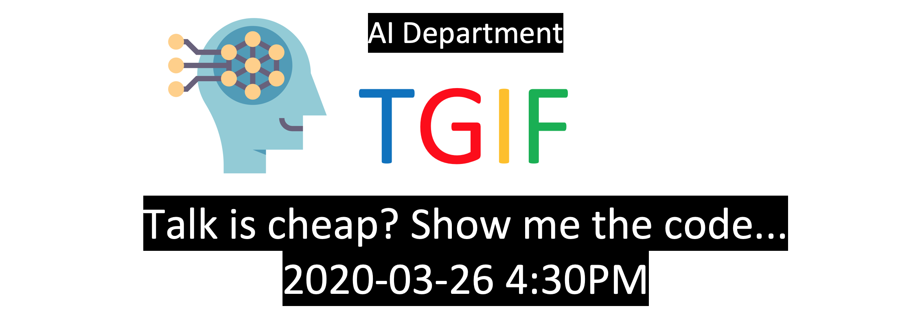

# TGIF 2020-03-26 Talk is cheap? Show me the code...

| 序号 | 姓名 | 机构 | 主题 |
| ---- | ---- | ----|-----|
|1| 邓建龙 | AI部门 | [从零开始，手把手教你打造语音识别系统](https://blog.csdn.net/weixin_39380002/article/details/105083443)|
|2| 文硕 | 网易游戏 | [业界顶级AI项目与产品管理痛点突破](Document/文硕.20200326.pptx) |
|3| 杨海韵 | AI部门 | [从数据标签到建模，从QA到系统性知识抽取方法](Document/海韵TGIF.pptx) |
|4| 徐晶晶 | 北京大学 | [文本生成与对抗学习](Document/TGIF分享演讲许晶晶.20200326.pdf)|
|5| 袁耀峰 | 广东工业大学 | 电子面单、二维码、条形码的检测定位 |
|6| 李艺如 | 新加坡国立大学 | [高分辨率深度神经网络HRNet](Document/HRNet-Lyr.pdf)|
|7| 陈卓 | 盟讯科技 | [基于深度时空残差网络的区域人流密度预测](Document/陈卓TGIF分享演讲.20200326.pptx)|
|8| 李超 | 新蛋科技 | 基于深度学习的表格识别 |
|9| 刘全 | 中科院 | [GAN核心生成逻辑源代码剖析](Document/Generative_Adversarial_Network.py)|

