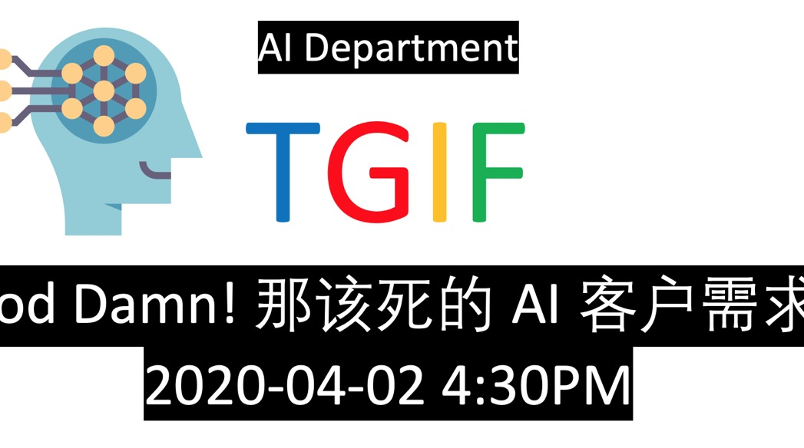

# TGIF 2020-04-02 God Damn! 那该死的AI客户需求

| 序号 | 姓名 | 机构 | 主题 |
| ---- | ---- | ----|-----|
|1| 吕永强 | 华声云科技 | [下一代智慧舆情技术展望](https://github.com/weijiang2009/URun.ResearchPrototype/tree/dev/People/Xiaoxian/NLP%E5%9F%BA%E7%A1%80%E7%9F%A5%E8%AF%86%E6%95%B4%E7%90%86/Transformer%E7%AC%94%E8%AE%B0)|
|2| 杨帆 | 林猫科技 | 基于深度学习的野生动物识别 |
|3| 翟瑞聪 | 电力行业人工智能从业者 | [人工智能在输电线路航采数据中的应用](Document/mmdetection目标检测框架使用及扩展.pdf) |
|4| 李超 | 新蛋科技 | [基于深度学习的表格识别](Document/Kylin.md)|
|5| 刘全 | 中科院 | [GAN核心生成逻辑源代码剖析](Document/ChineseChessBoardRecognization.pdf)|
|6| 范文正 | 美国科罗拉多矿业大学 | [NCAA机器学习数据竞赛总结](https://zhuanlan.zhihu.com/p/114212581?utm_source=wechat_session&utm_medium=social&utm_oi=606604221169143808&from=singlemessage)|
