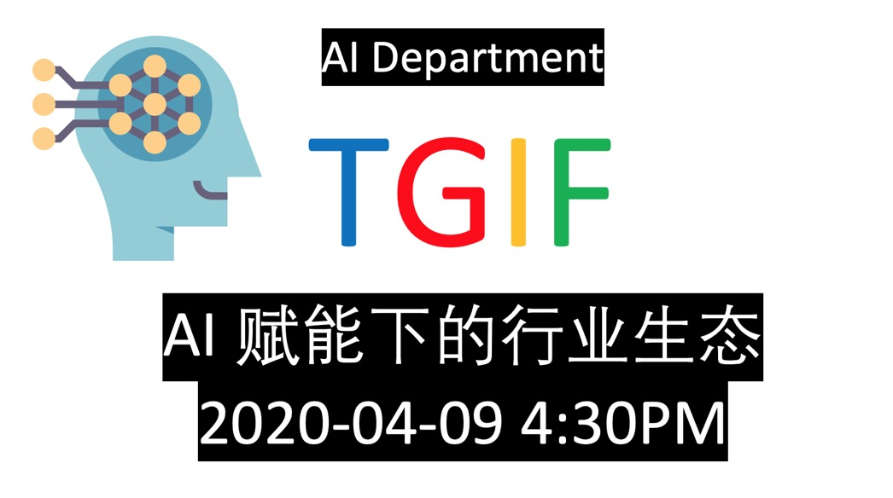

# TGIF 2020-04-09 AI赋能下的行业生态

| 序号 | 姓名 | 机构 | 主题 |
| ---- | ---- | ----|-----|
|1| 杨祖业 | 中科博微 | [博微云与智能制造](Documents/TGIF.20200409.分享模版.pdf)|
|2| Susan Guo | 人力资源顾问 | [HR如何助力创业团队搭建](Documents/HR助力创业团队_V3_20.04.09_Share.pptx) |
|3| 江立锋 | 爱特安为 | 我所了解的AI相关需求与落地方案|
|4| 王凤娇 | AI部门 | [使用小程序做载体同时演示9种AI预测能力](Document/TGIF分享演讲许晶晶.20200326.pdf)|
|5| 范文正 | 美国科罗拉多矿业大学 | [浅谈基于深度学习的搜索与推荐](Documents/搜索与推荐.pptx) |
